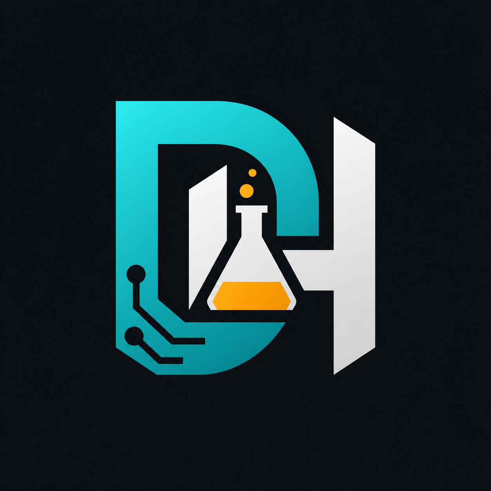

  

# DeHor Labs

DeHor Labs is an independent software lab for practical open-source tools, automation, and applied AI.

This organization is being shaped as the home for my public projects: small systems, developer utilities, experiments, and products that are useful enough to keep improving.

## Focus

- Developer tools and workflow automation
- Applied AI products and agents
- Infrastructure glue for small teams and indie builders
- Public experiments with real-world constraints

## Principles

- Useful before clever
- Clear behavior over vague demos
- Simple interfaces for messy workflows
- Built from Brazil, useful anywhere
