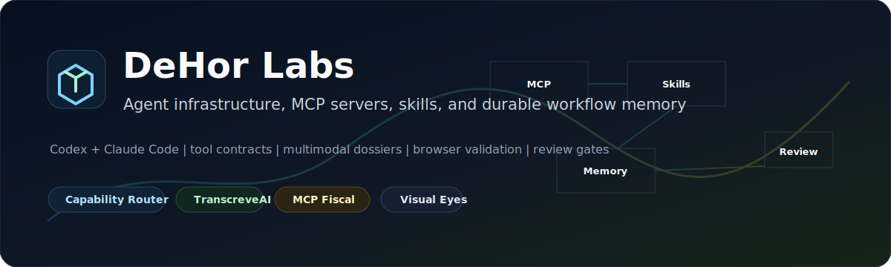

# DeHor Labs

Agent infrastructure, MCP servers, and developer tools for teams that need AI workflows to run in real environments.

We build small systems around strict tool contracts, searchable operational memory, browser-visible validation, and review loops that can survive production constraints.

## Start Here

### Agent Operating Layer

- **[Agent Capability Router](https://github.com/DeHor-Labs/agent-capability-router)** - a runtime-neutral skill that helps Codex and Claude Code choose when to use tools, plugins, skills, subagents, automations, and deeper research.
- **[Visual Eyes](https://github.com/DeHor-Labs/visual-eyes)** - visual inspection for running web apps in Claude Code.
- **[Semtree](https://github.com/DeHor-Labs/semtree)** - semantic code-tree tooling for assistants navigating large repositories.

### Knowledge And Domain Systems

- **[TranscreveAI](https://github.com/DeHor-Labs/transcreve-ai)** - video links, Reels, frames, OCR, and transcripts into multimodal dossiers, content packs, skill drafts, batch reports, and RAG-ready knowledge.
- **[MCP Fiscal Brasil](https://github.com/DeHor-Labs/mcp-fiscal-brasil)** - Brazilian fiscal workflows through MCP: CNPJ, NFe, NFSe, SPED, eSocial, and related automations.

### Safety And Orchestration

- **[ShieldCode](https://github.com/DeHor-Labs/shieldcode)** - security hardening and production-grade error handling for AI-assisted development.
- **[claude-orchestration](https://github.com/DeHor-Labs/claude-orchestration)** - multi-agent orchestration guidelines and reusable operating patterns.
- **[agent-stack-public](https://github.com/DeHor-Labs/agent-stack-public)** - public map of a Codex and Claude Code agent stack, sanitized for reuse.

## What We Optimize For

- Tool surfaces agents can call safely.
- Context that becomes reusable memory.
- CI, review gates, and traceable decisions.
- Browser/UI inspection as part of coding-agent workflows.
- Brazilian business, fiscal, and operational automation.

## Signature Line

**TranscreveAI** is the current center of gravity: an agent-ready video intelligence pipeline that can process messy social/video inputs, extract evidence, generate reusable artifacts, index the result, and hand it back to a parent agent as durable knowledge.

## Contact

[dehor.dev](https://dehor.dev) | [Nikolas de Hor](https://github.com/nikolasdehor)
